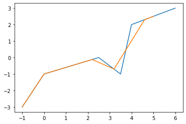
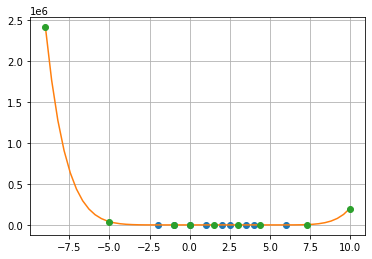
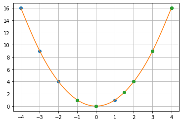

# This version for separate folds
## How to execute a program?

1) From python3 

You have to write "python3 " + the number of the program that you want to check.
For example:

    python3 Hauss.py 

2) Jupyter

You have to write "jupyter notebook " and of the homework that you want to check.
Secondly, you must add ".ipynb" to the note.
For example:
  
    jupyter notebook homework1.ipynb

To execute the programs in Jupyter press button-combination Shift+Enter.

## Hint for understaing:
This program take input data from files. So, user can't excute it from the main directory of the repository.

Lets note what programs use:
  
  linear_interpolation: train1.dat, train1.ans, test1.dat, test1.ans
  
  Lagrange_interpolate: train2.dat, train2.ans, test2.dat, test2.ans
  
  spline: train.dat, train.ans, test.dat, test.ans
  
 If you going to change input data, write your changes in the files train.dat, train.ans, test.dat.
 In test.ans you have an answer

## How does this programs works?
### Linear interpolation
If the two known points are given by the coordinates.
the linear interpolant is the straight line between these points. For a value x in the interval ( x0 , x1 ) the value y along the straight line is given from the equation of slopes (y - y0)/(x - x0) = (y1 - y0)/(x1 - x0)
which can be derived geometrically from the figure on the right. It is a special case of polynomial interpolation with n = 1.

Solving this equation for y, which is the unknown value at x, gives 

    y = y0 + (x - x0)(y1 - y0) / (x1 - x0) = (y0(x1 - x) + y1(x0 - x)) / (x1 - x0)
which is the formula for linear interpolation in the interval ( x 0 , x 1 ) . 
Outside this interval, the formula is identical to linear extrapolation.

This formula can also be understood as a weighted average. The weights are inversely related to the distance from the end points to the unknown point; the closer point has more influence than the farther point. 
Thus, the weights are (x − x0) / (x1 − x0) and (x1 − x) / (x1 − x0) ,which are normalized distances between the unknown point and each of the end points.

### Lagrange interpolation
which is the formula for linear interpolation in the interval (x0 ,x1). Outside this interval, the formula is identical to linear extrapolation.

In numerical analysis, Lagrange polynomials are used for polynomial interpolation. For a given set of points (xj, yj) values equal, the Lagrange polynomial is the polynomial of lowest degree that assumes at each value xj the corresponding value , so that the functions coincide at each point.

Although named after Joseph-Louis Lagrange, who published it in 1795, the method was first discovered in 1779 by Edward Waring It is also an easy consequence of a formula published in 1783 by Leonhard Euler.

Uses of Lagrange polynomials include the Newton–Cotes method of numerical integration and Shamir's secret sharing scheme in cryptography.

Lagrange interpolation is susceptible to Runge's phenomenon of large oscillation. As changing the points xj requires recalculating the entire interpolant, it is often easier to use Newton polynomials instead.  

Given a set of k + 1 data points:

    (x0, y0) ...(xj, yj)...(xk, yk)
where no two xj are the same, the interpolation polynomial in the Lagrange form is a linear combination:

    L(x) = SUM{j = 0; k}(yj -lj(x))
of Lagrange basis polynomials:
    
    lj(x) = MULT{0<=m<=k, m != k}((x - xm) / (xj - xm))

where 0 ≤ j ≤ k. 
Note how, given the initial assumption that no two xj are the same, then (when m ≠ j) xj − xm ≠ 0 , so this expression is always well-defined. 
The reason pairs xi = xj with yi ≠ yj are not allowed is that no interpolation function L such that yi = L(xi) would exist; 
a function can only get one value for each argument xi. 
On the other hand, if also yi = yj , then those two points would actually be one single point.

For all i ≠ j: lj(x)  includes the term (x − xi) in the numerator, so the whole product will be zero at x = xi: 
        
    Any (j ≠ i): lj(xi) = MULT{m ≠ j}((x - xm) / (xj - xm)) = 0
On the other hand, 
    
    lj(xi) = MULT{m ≠ j}((x - xm) / (xj - xm)) = 1

  In other words, all basis polynomials are zero at x = xi, except lj(x), for which it holds that lj(xj) = 1 , because it lacks the (x − xj) term.

It follows that yjlj(xj) = yj, so at each point xj, L(xj) = yj + 0 + 0 + ... + 0 = yj, showing that L interpolates the function exactly. 

### Spline interpolation

In the mathematical field of numerical analysis, spline interpolation is a form of interpolation where the interpolant is a special type of piecewise polynomial called a spline. 
Spline interpolation is often preferred over polynomial interpolation because the interpolation error can be made small even when using low degree polynomials for the spline. 
Spline interpolation avoids the problem of Runge's phenomenon, in which oscillation can occur between points when interpolating using high degree polynomials.

Given a set of n + 1 data points (xi,yi) where no two xi are the same and a = x0 < x1 < ...< xn = b, the spline S(x) is a function satisfying: 

1. S(x) from C^2[a, b];
2. On each subinterval [xi-1, xi], S(x)  is a polynomial of degree 3, where i = 1, ..., n
3. S(xi) = yi, for all i = 0, 1, .., n
Let us assume that:
        C1(x), x0 <= x <= x1
        ...
 S(x) = Ci(x), xi-1 < x <= xi
        ...
        Cn(x) , xn-1 < x <= xn 
 
 where each Ci = ai + bix + cix^2 + dix^3 (di ≠ 0) is a cubic function, i = 1 , ... , n.
## Illustartions of graphics
### Linear interpolation:
#### My algorithm:

#### Linalg algorithm:

### Lagrange interpolation:
#### My algorithm:

#### Linalg algorithm:

### Spline interpolation:

